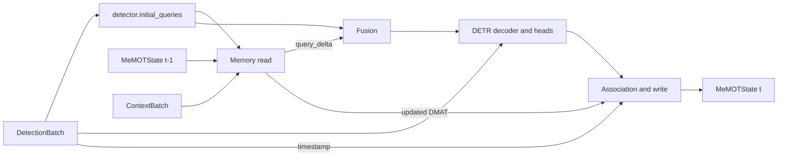

# MeMOT memory encoder

Этот модуль добавляет к DETR-подобному детектору рекуррентную память объектов:
хранит историю decoder queries, связывает предсказания между кадрами и
возвращает текущим queries временной `query_delta`.

Реализация основана на Memory Encoding из
[MeMOT](https://arxiv.org/abs/2203.16761), но не является полным трекером из
статьи. В ней нет отдельного Memory Decoder, proposal/track queries и
uniqueness head. Связь объектов поддерживается внутренней эвристической
association по геометрии и embeddings.

## Быстрое подключение

Для существующего `DetectorAdapter` блок можно подключить напрямую, без
изменения registry и Pydantic-конфигов:

```python
from context_detection.models.memory import MeMOTMemory
from context_detection.models.wrapper import ContextDetector

detector = MyDetrAdapter(original_model)
memory = MeMOTMemory(
    dim=detector.dim,
    num_heads=8,
    num_slots=300,
    memory_length=24,
    short_memory_length=3,
    write_threshold=0.5,
    max_missed=24,
    association_iou_threshold=0.1,
    association_cosine_threshold=0.5,
    association_appearance_weight=0.25,
    motion_momentum=0.8,
)
model = ContextDetector(
    detector=detector,
    context_module=memory,
    fusion="gated_residual",
    detach_state=True,
)
```

После этого состояние нужно передавать между последовательными кадрами:

```python
state = None

for batch, context in ordered_video_stream:
    output, state = model(batch, context, state)
```

Кадры одной строки батча должны принадлежать одной последовательности и идти
по времени. На первом кадре новой сцены выставляется
`batch.is_sequence_start[b] = True`.

## Поток данных одного кадра



`ContextDetector.forward` выполняет следующие шаги:

1. Сбрасывает строки памяти, помеченные `is_sequence_start`.
2. Получает начальные object queries детектора.
3. Читает MeMOT-память и получает `query_delta`.
4. Смешивает исходные queries и delta выбранным `Fusion`.
5. Запускает decoder и detection heads.
6. Сопоставляет уверенные предсказания с track slots и обновляет память.
7. По умолчанию делает `state.detach()`, ограничивая BPTT одним кадром.

Первый кадр читается как baseline: пока состояние отсутствует, `query_delta`
точно равен нулю.

## Устройство состояния

`MeMOTState` расширяет общий `MemoryState`.

| Поле | Форма | Назначение |
|---|---:|---|
| `feature` | `[B, S, D]` | Последний decoder embedding track slot |
| `box` | `[B, S, 4]` | Последний бокс в normalized `cxcywh` |
| `timestamp` | `[B, S]` | Время последнего наблюдения в секундах |
| `confidence` | `[B, S]` | Последняя foreground confidence |
| `age` | `[B, S]` | Возраст слота в обработанных кадрах |
| `valid` | `[B, S]` | Слот занят активной гипотезой |
| `observed` | `[B, S]` | Слот сопоставлен на текущем кадре |
| `motion` | `[B, S, 4]` | EMA-оценка скорости бокса в секунду |
| `history_feature` | `[B, S, T, D]` | FIFO-история embeddings |
| `history_valid` | `[B, S, T]` | Маска реальных наблюдений истории |
| `history_timestamp` | `[B, S, T]` | Время каждого наблюдения |
| `dmat` | `[B, S, D]` | Рекуррентный Dynamic Memory Aggregation Token |
| `missed` | `[B, S]` | Число последовательных пропущенных кадров |
| `clock` | `[B]` | Время последнего обработанного кадра |
| `evicted` | `[B]` | Число завершённых/замещённых слотов на записи |

Состояние всегда хранится в `float32`. При AMP история временно приводится к
dtype текущих queries внутри attention.

## Чтение памяти

### 1. Временное кодирование

Для каждого элемента истории вычисляется

```text
dt = current_timestamp - history_timestamp
```

В attention embedding добавляется обучаемое кодирование двух величин:
`log(1 + dt)` и `dt / context_horizon`. `context_horizon` берётся из
максимального валидного `ContextBatch.time_offsets`, поэтому блок различает
разный временной масштаб видео и не использует `valid_mask` только как общий
boolean.

В production следует всегда передавать `DetectionBatch.timestamp`. Fallback для
прямого вызова `read/write` прибавляет к `state.clock` минимальный положительный
`time_offset`, но он предназначен главным образом для синтетических проверок.
Время не может идти назад: такой вызов завершается `ValueError`.

### 2. Short-term branch

Для каждого активного slot выбираются последние `short_memory_length`
наблюдений. Последнее валидное состояние используется как query, а история —
как keys/values multi-head cross-attention. Результат — AST, Aggregated
Short-term Token.

### 3. Long-term branch

Вся FIFO-история длины `memory_length` читается рекуррентным DMAT. Для нового
track slot используется общий обучаемый `initial_dmat`; далее DMAT переносится
между кадрами. Результат — ALT, Aggregated Long-term Token.

### 4. Fusion и retrieval

AST и ALT проходят self-attention. Первый выход становится track token, второй
— DMAT следующего шага. Текущие DETR queries читают активные track tokens ещё
одним cross-attention, после чего линейная проекция формирует `query_delta`.

`gated_residual` обычно является безопасным режимом подключения:

```text
query_for_decoder = query + sigmoid(gate([query, delta])) * delta
```

Гейт инициализирован почти закрытым, поэтому обучение начинается рядом с
исходным DETR baseline.

## Association и запись

После DETR decoder блок вычисляет foreground confidence:

```python
confidence = output.logits.sigmoid().amax(dim=-1)
```

Предсказания ниже `write_threshold` не записываются. Для каждого занятого
слота последний бокс переносится к текущему timestamp constant-velocity
моделью. Затем для detection-slot пары считаются IoU и cosine similarity.

Пара допускается к association, если выполнено хотя бы одно условие:

```text
IoU >= association_iou_threshold
cosine >= association_cosine_threshold
```

Допустимые пары сортируются по score:

```text
IoU + association_appearance_weight * (cosine + 1) / 2
```

После жадного one-to-one matching:

- сопоставленные detections обновляют прежние slots;
- несопоставленные уверенные detections занимают свободные slots;
- пропущенный slot сохраняет последнее состояние и получает zero padding в
  FIFO-истории;
- после `max_missed + 1` пропусков slot освобождается;
- если свободных slots нет, сначала заменяется наиболее долго пропущенный,
  затем наиболее старый и наименее уверенный slot;
- при новом использовании slot его history, motion и DMAT полностью очищаются.

Скорость бокса обновляется EMA с коэффициентом `motion_momentum`.

## Контракт адаптера произвольного DETR

Нужно реализовать четыре части `DetectorAdapter`:

```python
from torch import Tensor

from context_detection.contracts import DetectionBatch, DetectorOutput
from context_detection.models.detector import DetectorAdapter


class MyDetrAdapter(DetectorAdapter):
    def __init__(self, model) -> None:
        super().__init__()
        self.model = model
        self._dim = model.hidden_dim

    @property
    def dim(self) -> int:
        return self._dim

    def initial_queries(self, batch: DetectionBatch) -> Tensor:
        # Learned-query DETR: [N, D] -> [B, N, D].
        queries = self.model.query_embed.weight
        return queries.unsqueeze(0).expand(batch.batch_size, -1, -1)

    def forward(
        self,
        batch: DetectionBatch,
        query_init: Tensor | None = None,
    ) -> DetectorOutput:
        feature_levels = list(self.model.backbone(batch.images))
        queries = self.initial_queries(batch) if query_init is None else query_init
        decoder_layers = self.model.decode(feature_levels, queries)
        final_queries = decoder_layers[-1]
        logits = self.model.class_head(final_queries)
        boxes = self.model.box_head(final_queries).sigmoid()

        return DetectorOutput(
            logits=logits,
            boxes=boxes,
            queries=final_queries,
            reference_points=boxes.detach(),
            features=feature_levels,
            decoder_layers=[{"queries": layer} for layer in decoder_layers],
        )

    def freeze(self, backbone: bool = True, decoder: bool = False) -> None:
        for parameter in self.model.backbone.parameters():
            parameter.requires_grad_(not backbone)
        for parameter in self.model.decoder.parameters():
            parameter.requires_grad_(not decoder)
```

Это каркас: названия методов backbone/decoder/heads нужно заменить API
конкретной модели.

### Требования к `initial_queries`

- Результат имеет форму `[B, N, D]`.
- `D` совпадает с `adapter.dim` и `MeMOTMemory.dim`.
- Переданный в `forward(query_init=...)` тензор действительно должен стать
  входом decoder. Нельзя молча проигнорировать его и создать queries заново.
- `forward(query_init=None)` должен воспроизводить исходный DETR baseline.

Для DETR с learned object queries реализация обычно сводится к `Embedding`
и не запускает backbone.

### Two-stage DETR

В two-stage моделях initial queries часто выбираются из выхода encoder. Если
`initial_queries` самостоятельно запустит backbone/encoder, а `forward` затем
повторит вычисления, стоимость детектора почти удвоится.

В текущем контракте адаптеру нужен одношаговый кэш подготовленных features:

```python
def initial_queries(self, batch: DetectionBatch) -> Tensor:
    features = self.model.backbone(batch.images)
    encoded = self.model.encoder(features)
    queries, reference_points = self.model.select_proposals(encoded)
    self._prepared = (features, encoded, reference_points)
    return queries

def forward(self, batch, query_init=None) -> DetectorOutput:
    features, encoded, reference_points = self._prepared
    self._prepared = None
    queries = self.initial_queries(batch) if query_init is None else query_init
    # Decoder использует уже вычисленные encoded/features.
    ...
```

Такой кэш должен очищаться после каждого `forward` и не подходит для
re-entrant/concurrent вызовов одного экземпляра адаптера. Для параллельного
serving лучше расширить протокол отдельным объектом `PreparedDetectorInput`, а
не хранить mutable cache на модуле.

### Требования к `DetectorOutput`

| Поле | Требование |
|---|---|
| `logits` | `[B, N, C]`, logits foreground-классов |
| `boxes` | `[B, N, 4]`, normalized `cxcywh` в `[0, 1]` |
| `queries` | `[B, N, D]`, финальные decoder embeddings |
| `reference_points` | `[B, N, 4]`, anchor/reference boxes |
| `features` | Multi-scale features; для MeMOT могут быть пустыми |
| `decoder_layers` | Список слоёв с ключом `queries`; нужен для aux-loss |

Текущий confidence extractor предполагает sigmoid/focal-style foreground
logits. Если исходный DETR использует softmax с отдельным `no-object` классом,
нельзя передавать этот класс как обычный foreground. Адаптер должен исключить
его и вернуть foreground logits с эквивалентной вероятностной семантикой либо
нужно вынести вычисление confidence в отдельную стратегию памяти.

Для plain DETR без reference points можно временно вернуть `boxes.detach()`.
MeMOT encoder использует `output.boxes`, но общий контракт всё равно требует
поле `reference_points`.

## Подготовка входных контрактов

### `DetectionBatch`

Критические поля для рекуррентной памяти:

```python
batch = DetectionBatch(
    images=images,
    targets=targets,
    sequence_id=sequence_ids,
    frame_id=frame_ids,
    timestamp=timestamps_seconds,
    is_sequence_start=sequence_start_mask,
)
```

- `timestamp` — `float32` секунды, монотонные внутри sequence.
- `is_sequence_start` — `True` при смене видео/сцены.
- Позиция `b` в state должна продолжать ту же sequence, что и позиция `b` в
  следующем батче. Если sampler переставляет видео между строками, state нужно
  переставить или сбросить той же перестановкой.

### `ContextBatch`

MeMOT не требует пиксели прошлых кадров, поэтому `images=None` допустим:

```python
context = ContextBatch(
    images=None,
    valid_mask=history_is_available,
    time_offsets=history_offsets_seconds,
)
```

`valid_mask=False` означает padding. Для валидных элементов `time_offsets`
строго положительны, для padding равны нулю. Если вся строка не имеет прошлого,
memory read для неё отключается.

## Подключение через конфиг проекта

Готовый пример находится в
[`configs/memory_memot.json`](../configs/memory_memot.json). Фабрика передаёт
размерность и число heads из detector-конфига:

```python
from context_detection.build import build_model
from context_detection.config import load_config

config = load_config(
    "configs/memory_memot.json",
    ["data.root=/path/to/dataset"],
)
model = build_model(config)
```

Для нового имени детектора нужно дополнить `DetectorName` в
[`registry.py`](../src/context_detection/registry.py) и ветку
`build_detector` в [`build.py`](../src/context_detection/build.py). Если
адаптер создаётся в коде приложения, проще использовать прямую сборку из
первого раздела и не менять registry.

## Параметры

| Параметр | Пример | Эффект |
|---|---:|---|
| `num_slots` | 300 | Максимальное число одновременно хранимых track hypotheses |
| `memory_length` | 24 | Длина FIFO по каждому slot |
| `short_memory_length` | 3 | Окно short-term attention |
| `write_threshold` | 0.5 | Минимальная foreground confidence для записи |
| `max_missed` | 24 | Сколько пропущенных кадров slot сохраняется |
| `association_iou_threshold` | 0.1 | Минимальный IoU для допустимой пары |
| `association_cosine_threshold` | 0.5 | Минимальная cosine similarity для допустимой пары |
| `association_appearance_weight` | 0.25 | Вес appearance в matching score |
| `motion_momentum` | 0.8 | EMA-инерция constant-velocity модели |

Рекомендуется начать с консервативного `write_threshold` и проверить
`write_rate`. Слишком низкий порог записывает background queries, слишком
высокий оставляет память пустой.

## Обучение

- Association дискретная и не дифференцируется; attention, temporal encoding,
  DMAT, fusion и query retrieval обучаются обычным backward.
- `detach_state=True` ограничивает граф одним кадром, но численные значения
  DMAT и истории продолжают переноситься между кадрами.
- Для полного BPTT установите `detach_state=False`; память графа растёт с
  длиной клипа.
- Оптимизатор должен получать параметры всего `ContextDetector`, иначе
  `initial_dmat`, attention и fusion не обновятся.
- Training sampler обязан выдавать кадры последовательно внутри каждой строки
  батча.

## Диагностика

`ContextOutput.diagnostics` содержит:

- `active_slots` — число slots, участвовавших в чтении;
- `mean_age` — средний возраст активных slots;
- `mean_missed` — среднее число текущих пропусков;
- `write_rate` — доля slots, наблюдавшихся на предыдущей записи;
- `evicted` — число завершённых/замещённых slots;
- `read_weights` — внимание DETR queries к track tokens;
- `short_read_weights`, `long_read_weights` — веса временных веток.

## Типичные проблемы

### Память не влияет на предсказания

- На первом кадре нулевой delta ожидаем.
- Проверьте `context.valid_mask`: полностью пустая строка отключает чтение.
- Проверьте `active_slots` и `write_rate`.
- Убедитесь, что адаптер использует `query_init` в decoder.
- Слишком высокий `write_threshold` не создаёт slots.

### Все queries записываются как объекты

Вероятнее всего, logits имеют softmax/no-object семантику, несовместимую с
текущим `sigmoid().amax()`. Нормализуйте foreground logits в адаптере или
замените confidence strategy.

### Частые identity switches

- Проверьте формат боксов: только normalized `cxcywh`.
- Проверьте единицы timestamp и порядок кадров.
- Уменьшите IoU threshold при быстром движении либо cosine threshold при
  нестабильных decoder embeddings.
- Если разные объекты имеют похожие embeddings, увеличьте роль IoU или
  уменьшите `association_appearance_weight`.

### `current_timestamp не может идти назад`

Sampler нарушил порядок кадров, state был передан другой sequence либо при
смене сцены не выставлен `is_sequence_start`.

### Slot нового объекта содержит старый DMAT

Такого происходить не должно: expiry и forced replacement очищают DMAT,
motion и всю историю. Запустите smoke-suite и проверьте кастомные изменения в
`write`.

## Проверка интеграции

```bash
ruff format --check src tests tools
ruff check src tests tools
pytest -q
python tools/cli.py smoke configs/memory_memot.json
```

Smoke-suite проверяет masking, перестановку DETR queries, timestamps и motion,
expiry/reuse slots, backward и два полных шага `ContextDetector`.

## Что нужно для полного MeMOT

Следующий архитектурный шаг — расширить detector protocol:

1. Разделить fresh proposal queries и persistent track queries.
2. Передавать track tokens отдельными decoder queries, а не сворачивать их в
   delta для proposal queries.
3. Добавить objectness и uniqueness heads.
4. Обучать association по identity annotations.
5. Управлять рождением и завершением tracklets на выходе Memory Decoder.

До этого момента модуль следует называть MeMOT-inspired memory encoder, а не
полной реализацией MeMOT tracking pipeline.
